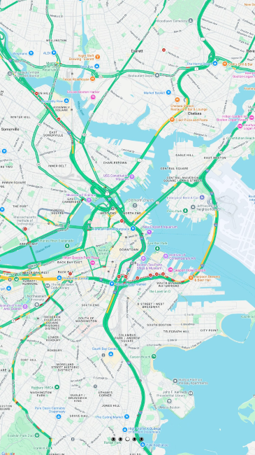

# MM-SmartScreen

SmartScreen is a [MagicMirror](https://github.com/MagicMirrorOrg/MagicMirror)-based application designed to run customized modules optimized for touchscreens. This is a personal project created to meet my own needs and is not currently tailored for widespread community use (though it may be in the future). In its current state, the app requires significant cleanup and will improve over time, including efforts such as code linting and general code cleanup. At present, the app only includes embedded modules, some of which are adapted from the MagicMirror community, while others are custom-built.

Currently, the modules include:
- MM-8x8: Enables selecting and uploading icons to a homemade ESP32 8x8 LED matrix display.
- [MMM-GoogleMapsTraffic](https://github.com/vicmora/MMM-GoogleMapsTraffic)
- [MMM-pages](https://github.com/edward-shen/MMM-pages)
- MMM-SonosTouch: Sonos module optimized for fullscreen display and touch. Based on the [MMM-Sonos](https://github.com/CFenner/MMM-Sonos) module
- [MMM-WeatherChart](https://github.com/mtatsuma/MMM-WeatherChart.git)
- [MMM-windy](https://github.com/santi4488/MMM-windy)
- [WallberryTheme](https://github.com/delightedCrow/WallberryTheme)

Tested on:

Hardware:
- Planar 22" Touch Screen HD LED LCD 1080p PC Monitor PCT2265 w/ VGA POWER USB 3.0 (found on ebay)

OS:
- Windows 11

## Install

`npm run install-mm`

OR

`npm install`
`cd fonts && npm install`
`cd vendor && npm install`
`cd node-sonos-http-api && npm install`

## Run
`cd node-sonos-http-api && npm run`
`npm run start:win`
